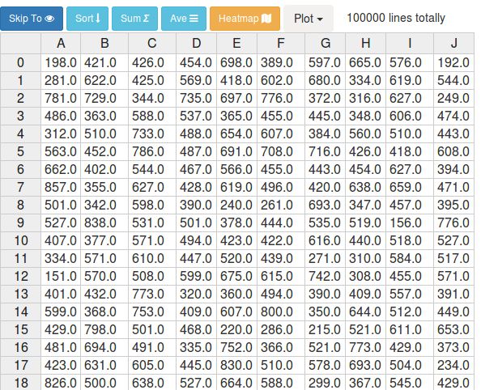

# BDViewer
An extension for Jupyter Notebook for large csv files viewing and simple processing.

## Introduction
- Make large csv files viewing easier on Jupyter Notebook. When the csv file is too larg, this extension can help you open it quickly. And at the same time, you can do some computation such as sorting, summing. While you click a computing button(Sort, Sum, Aevrage or Max), the back end will compute it in a parallel manner.



## Install
Make sure Spark and MPI has been set up first.
```
sudo ./install.sh
```
